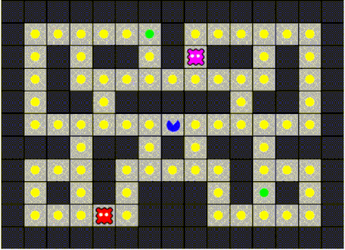
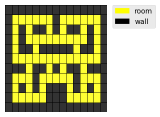

# My own Pacman for Reinforcement Learning
This depository contains the code of a Pacman game I wrote from scratch for testing reinforcement learning algorithms.

Currently, 2 algorithms are implemented, DQN and A2C.

## To run games

To let Pacman play games run the command below in a terminal.
```bash
python pacman_play.py
```

In the file `pacman_play.py` you can set the configuration you want for the games.

`n_games` is the number of game to run.

If it is set to 1, then the game is displayed as in the example below.



(***In the "Media" directory you will find the same with music...***)

If it is set to a value bigger than 1, then `n_games` are played and statistics are provided at the end.

This is an example, of output obtain with `n_games = 1000` with the A2C agent.
```bash
Pacman won 79.40% of the games
Number of game aborted:
	with 0 ghost: 0
	with 1 ghost: 0
	with 2 ghost: 0
Percentage of games with
	0 ghost: 51.4
	1 ghost: 28.2
	2 ghost: 20.4
Average number of ghost per game: 0.69
Percentage of power cookies eaten per game:
	0 power cookies: 9.9
	1 power cookies: 6.7
	2 power cookies: 83.4
Average number of power cookies eaten per game: 1.735
```

## To train the model

To train the model run the command below in a terminal.
```bash
python pacman_training.py
```

In the main function in file `pacman_training.py` you can select the agent you want to train.

```Python
if __name__ == "__main__":
    
    #dqn_training()
    a2c_training()
```

You can also configure the game, the hyperparameters (e.g `initial_learning_rate`), etc.

Example:
```Python
pacman_conf = PacmanConf(playground = pacman_map3,
                         ghost_aggressivities = [0.72, 0.62], #, 0.52, 0.42],
                         edible_ghosts_behavior = [EdibleGhostBehaviors.FLEE_FAST,EdibleGhostBehaviors.FLEE_FAST],
                         n_ghosts = 2,
                         n_power_cookies = 2,
                         max_power_credit = 12,
                         eat_cookie_reward = 0.6,
                         eat_power_cookie_reward = 1.3,
                         eat_ghost_reward = 22,
                         living_cost = -0.15,
                         lose_reward = -35,
                         win_reward = 30,
                         win_penalty_per_ghost = -5)
```

## Some explanations about the software

### The files

`pacman_maps.py` is where to find the class ```PacmanMap``` use to create boards from
array of 'o' and '1's.

Boards are defined as an array of '0' and '1'.

Below is and example.
```bash
pacman_map3 = PacmanMap([[1,1,1,1,1,1,1,1,1,1,1,1,1,1,1],
                         [1,0,0,0,0,0,0,1,0,0,0,0,0,0,1],
                         [1,0,1,0,1,1,0,1,0,1,1,0,1,0,1],
                         [1,0,1,0,0,0,0,0,0,0,0,0,1,0,1],
                         [1,0,1,1,0,1,1,1,1,1,0,1,1,0,1],
                         [1,0,0,0,0,0,0,0,0,0,0,0,0,0,1],
                         [1,1,1,0,1,1,0,1,0,1,1,0,1,1,1],
                         [1,0,0,0,1,0,0,0,0,0,1,0,0,0,1],
                         [1,0,1,0,1,0,1,1,1,0,1,0,1,0,1],
                         [1,0,0,0,0,0,1,1,1,0,0,0,0,0,1],
                         [1,1,1,1,1,1,1,1,1,1,1,1,1,1,1]])
```
Gives the board:



`algorthms.py` contains the algorithms for the agent.
Currently, two algorithms are defined, DQN and A2C.

`ghost_agent.py` contains the class `PacmanGhost` that defines the ghosts and their behaviors.

`memories.py` is where the classes for the Rollout memory (used in A2C) and for the 
Replay memory (used for DQN) are implemented.

`neural_net.py` is for the definition of the convolutional neural networks used in DQN and A2C.

`pacman_agents.py` is where to find the classes for the DQN and A2C agents

`pacman_env.py` is dedicated for the definition of the Pacman environment.

`pacman_conf.py` just contain a dataclass used for the configuration of the game.

And we already talked about `pacman_play.py` and `pacman_train.py`.

### The code

#### Agents (`pacman_agents.py`)

`PacmanAgent` is the parent of all derived agents, `DQN_PacmanAgent` and `A2C_PacmanAgent`.\
The function `run_episodes()` is used for the training.

Let's have a look to the main steps in the case of **A2C**.\
The most important part of the code is the loop that runs an episode in each environments.
```Python
            while True:
                value_losses = []
                policy_losses = []
                
                for env_idx in range(self.n_envs):
                    if self.pacman_envs[env_idx].end == True:
                        continue
                    # Take up to n_steps in each environment
                    for step in range(self.n_steps):
                        self.take_action(env_idx)

                        env = self.pacman_envs[env_idx]
                        if env.end == True:
                            lost_count += int(env.dead == True)
                            ghost_count += len(env.ghosts)
                            finished_games += 1
                            break

                    value_loss, policy_loss = self.A2C.compute_losses(env_idx, step+1,
                                                                      self.pacman_envs[env_idx].end)
                    value_losses.append(value_loss)
                    policy_losses.append(policy_loss)
                
                self.A2C.update(value_losses, policy_losses)
```
There, for each environment where the game is not finished, the agent takes up to `n` steps 
(call to the local function `take_action()`). Once the `n` actions were taken (or the game ended), The value loss and the policy loss are computed (call to `A2C.compute_losses()` that is defined in `algorithms.py`). Then those losses collected from all the environments are passed to the A2C object for updating the network (call to `A2C.update()` that is defined in `algorithms.py`).

Let's detail a bit the function `take_action()`.\
```Python
    def take_action(self, env_idx):
        # get the current state
        state = self.current_state[env_idx]
        
        # Take action according to current policy
        action_idx, action = self.select_action(state, stockastic=True,
                                                env_idx=env_idx)
    
        reward = self.pacman_envs[env_idx].step(action)
        self.episode_rewards.append(reward)

        # get the reached state
        rgb = self.pacman_envs[env_idx].rgb_image
        np_img = self.image_processing(rgb)
        # Put in the format for Pytorch Conv2d
        new_state = self.image_to_state(np_img)
        
        # Update current state
        self.current_state[env_idx] = new_state

        # Add a new entry in the rollout memory
        self.A2C.memory[env_idx].insert(new_state,
                                        torch.Tensor([action_idx]).type(torch.int64),
                                        reward)
```
It first call `select_action()` which performs the following actions:
1. the logits for the Qvalues of the 5 possible actions 
(`East`, `West`, `North`, `South` `Idle`) and the state's value are obtained from the 
call to `A2C.a2c_net()`
2. then a softmax function is applied to the logits to get the policy probabilities
$\pi(a|s)$
3. the action is then selected using a multinomial law of parameter $\pi(a|s)$.

After that, the action is passed to the environment (call to the environment `step()` function).\
The environment then update the state and returns a reward. 

Lastly, the reached state, the action taken and the received reward are stored in the Rollout memory.

#### Algorithms (`pacman_algorithms.py`)

##### About A2C implementation

The computation of the value and policy losses is done in the `A2C` class' function `compute_losses()`.
<html>
<ul>
<li><p>For the policy the loss to compute is:
<br/> <br/>
<span class="math display">$$\mathcal{L}_{\pi} =
- \frac{1}{k} \sum_{j=0}^{k-1} \delta_{t+j} \cdot
log\;\pi(a_{t+j}|s_{t+j}) -  \eta \frac{1}{k}\sum_{j=0}^{k-1}\big( \delta_{t+j} \big)^2$$</span></p></li>
<li><p>For the value function the loss to compute is:
<br/> <br/> 
<span class="math display">$$\mathcal{L}_{v} =
\frac{1}{k}\sum_{j=0}^{k-1}\big( \delta_{t+j} \big)^2$$</span></p></li>
</ul>
</html>

Where `k` is at most the number of steps `n` for the advantage computation. 
(if the game ends before `n` steps are taken, then `k` is less than `n`)

## TODO
I still have some code cleaning to do.\


